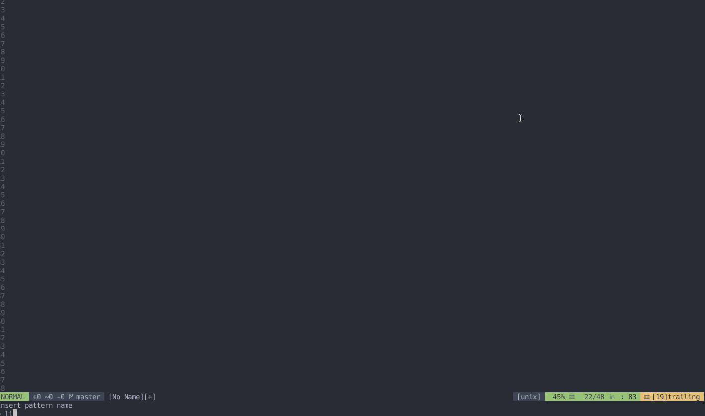

# vim-gol


A hacked-out implementation of [Conway's Game of Life](https://en.wikipedia.org/wiki/Conway%27s_Game_of_Life), written in Vimscript.

It's not good code, it'll probably break if you install it, but hey, I had an unreasonable amount of fun writing it.

So if I haven't talked you out of trying it yet, there's one command: `:GOL`. Try at your own peril.

```vim
" Vim-plug
Plug 'PsychoLlama/vim-gol', { 'on': 'GOL' }

" Vundle
Plugin 'PsychoLlama/vim-gol'
```
